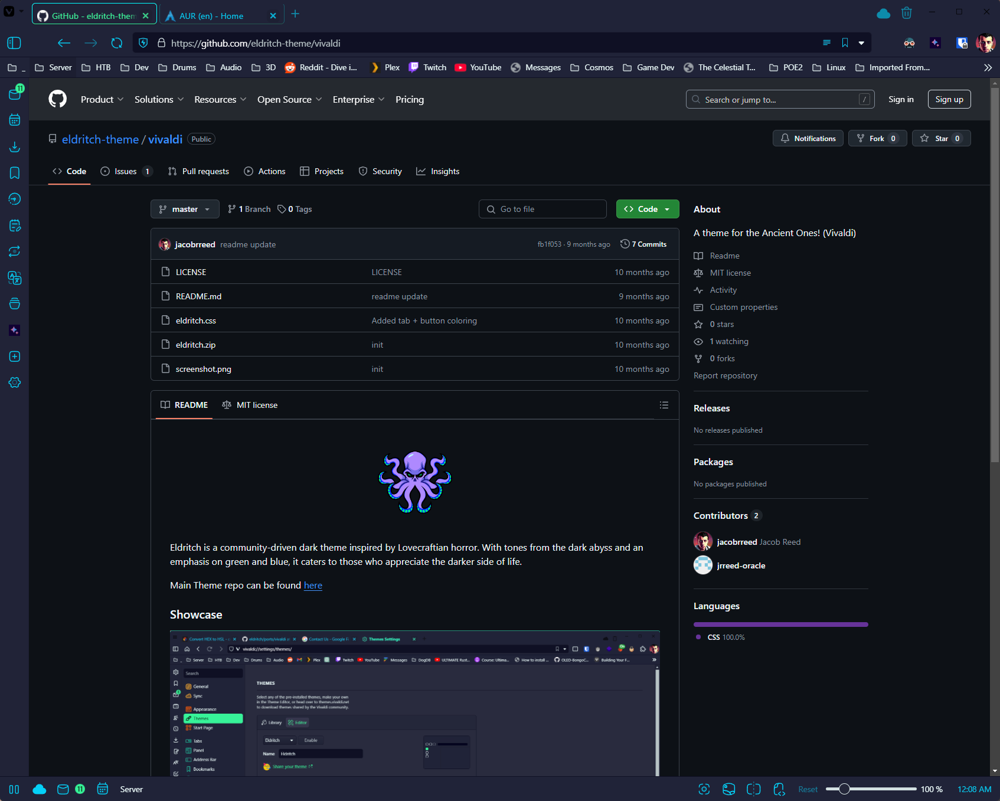

Eldritch is a community-driven dark theme inspired by Lovecraftian horror. With tones from the dark abyss and an emphasis on green and blue, it caters to those who appreciate the darker side of life.

Main Theme repo can be found [here](https://github.com/eldritch-theme/eldritch)

### Showcase

### Installation
1. From theme store:
   - https://themes.vivaldi.net/themes/zrnvL65r7L4 and click `Download theme`
2. From source:
   1. Download the `eldritch.zip` and place it somewhere you can find it.
   2. In Vivaldi -> Settings -> Themes -> Open Theme... -> Select the `eldritch.zip` file.
3. ***Optional for extra styling:***:
   1. Download the `eldritch.css` and place it somewhere you can find it.
   2. Go to `vivaldi://experiments` and check the box that says `Allow for using CSS modifications`.
   3. Go to `vivaldi://settings/appearance/` and under `CUSTOM UI MODIFICATION` click `Select Folder...`
   4. Select the folder containing the `eldritch.css` file. **Warning:** Any `.css` files in this folder will be applied
   5. Restart Vivaldi
